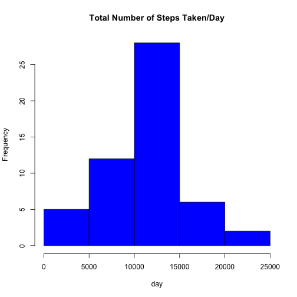
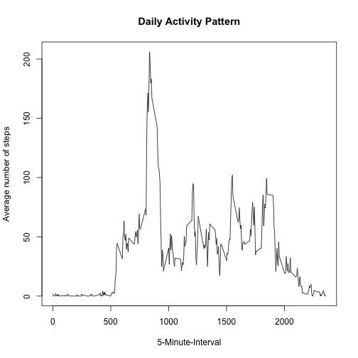
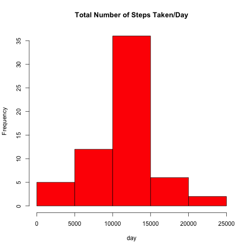
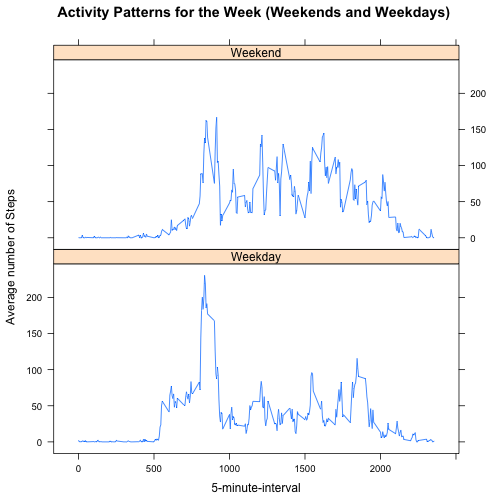

title: "Activity"     
author: "Pratheebha"
date: "June 13, 2015"
output: html_document
-----------------------

Loading and Preprocessing data from activity.csv file


```r
activity <- read.csv("activity.csv", sep =",", header = TRUE)
summary(activity)
```

```
##      steps                date          interval     
##  Min.   :  0.00   2012-10-01:  288   Min.   :   0.0  
##  1st Qu.:  0.00   2012-10-02:  288   1st Qu.: 588.8  
##  Median :  0.00   2012-10-03:  288   Median :1177.5  
##  Mean   : 37.38   2012-10-04:  288   Mean   :1177.5  
##  3rd Qu.: 12.00   2012-10-05:  288   3rd Qu.:1766.2  
##  Max.   :806.00   2012-10-06:  288   Max.   :2355.0  
##  NA's   :2304     (Other)   :15840
```

###Format the date using the date class and also find the sum of missing values in the variable steps and keep a count of them.

```r
activity$date <- as.Date(activity$date)
str(activity)
```

```
## 'data.frame':	17568 obs. of  3 variables:
##  $ steps   : int  NA NA NA NA NA NA NA NA NA NA ...
##  $ date    : Date, format: "2012-10-01" "2012-10-01" ...
##  $ interval: int  0 5 10 15 20 25 30 35 40 45 ...
```

```r
sum(is.na(activity$steps))
```

```
## [1] 2304
```

###What is the mean total number of steps taken per day?
1. Calculated the total number of steps taken per day
2. Calculated and reported the mean and median of the total number of steps taken per day.

```r
stepsTotal <- aggregate(steps ~ date, data = activity, sum, na.rm = TRUE)
mean(stepsTotal$steps)
```

```
## [1] 10766.19
```

```r
median(stepsTotal$steps)
```

```
## [1] 10765
```

###Plotting a Histogram of the total number of steps taken each day

```r
hist(stepsTotal$steps, main = "Total Number of Steps Taken/Day", xlab ="day", col = "blue")
```

 

###what is the average daily activity pattern?
### Make a timeseries plot of the 5-minute-interval and the average number of steos taken, averaged across all days.

```r
intervalSteps <- tapply(activity$steps, activity$interval, mean, na.rm = TRUE)
plot( y = intervalSteps, x = names(intervalSteps), type = "l", xlab = "5-Minute-Interval", ylab = "Average number of steps", main ="Daily Activity Pattern")
```

 


#### which 5-minute-interval, on average across all the days in the dataset, contains the maximum number of steps?

```r
maxInterval<- which.max(intervalSteps)
names(maxInterval)
```

```
## [1] "835"
```
###Imputing missing values
####Calculate and report the total number of missing values in the dataset (i.e. the total number of rows with NAs)

```r
sum(is.na(activity$steps))
```

```
## [1] 2304
```
####Devise a strategy for filling in all of the missing values in the dataset. The strategy used is to replace the na's by the mean of the steps taken per time interval . 

```r
newActivity <- activity
StepsAvg <- aggregate(steps ~ interval, data = activity, FUN = mean)
fillNA <- numeric()
for (i in 1:nrow(activity)) {
  observation <- activity[i, ]
if ( is.na(observation$steps)) {
  steps <- subset(StepsAvg, interval == observation$interval)$steps
}
else {
  steps <- observation$steps
}
fillNA <-c(fillNA,steps)
}
newActivity$steps <-fillNA
```
####checking if the newActivity dataframe has any missing values (NA's)

```r
sum (is.na(newActivity))
```

```
## [1] 0
```
#### Checking the difference between new and old data frame

```r
head(newActivity)
```

```
##       steps       date interval
## 1 1.7169811 2012-10-01        0
## 2 0.3396226 2012-10-01        5
## 3 0.1320755 2012-10-01       10
## 4 0.1509434 2012-10-01       15
## 5 0.0754717 2012-10-01       20
## 6 2.0943396 2012-10-01       25
```

```r
head(activity)
```

```
##   steps       date interval
## 1    NA 2012-10-01        0
## 2    NA 2012-10-01        5
## 3    NA 2012-10-01       10
## 4    NA 2012-10-01       15
## 5    NA 2012-10-01       20
## 6    NA 2012-10-01       25
```
####Make a histogram of the total number of steps taken each day and Calculate and report the mean and median total number of steps taken per day using new data without NAs

```r
stepsTotal2 <- aggregate(steps ~ date, data = newActivity, sum)
mean(stepsTotal2$steps)
```

```
## [1] 10766.19
```

```r
median(stepsTotal2$steps)
```

```
## [1] 10766.19
```

```r
hist(stepsTotal2$steps, main = "Total Number of Steps Taken/Day", xlab ="day", col = "red")
```

 

#### Conclusion: inputting the missing values changes the median slightly while the mean remains the same as well as there is no change in the histogram. 

###Are there differences in activity patterns between weekdays and weekends?

####Create a new factor variable in the dataset with two levels – “weekday” and “weekend” indicating whether a given date is a weekday or weekend day.

```r
day <- weekdays(newActivity$date)
day_level <- vector()
for ( i in 1:nrow(newActivity)) {
  if (day[i] == "Saturday" | day[i] == "Sunday") {
    day_level[i] <- "Weekend"
  } else {
      day_level[i] <- "Weekday"
    }
  }
  newActivity$day_level <- day_level
  newActivity$day_level <- factor(newActivity$day_level)
  
steps_by_day <- aggregate(steps ~ interval + day_level, data = newActivity, mean)
names(steps_by_day) <- c("interval", "day_level", "steps")
```
###Make a panel plot containing a time series plot (i.e. type = "l") of the 5-minute interval (x-axis) and the average number of steps taken, averaged across all weekday days or weekend days (y-axis).

```r
library(lattice)
xyplot(steps ~ interval | day_level, steps_by_day, type ="l", layout = c(1, 2), xlab = "5-minute-interval", ylab = "Average number of Steps", main =" Activity Patterns for the Week (Weekends and Weekdays)")
```

 
#### Conclusion : The two panel plots show a clear difference in the activity level between weekdays and weekends.

